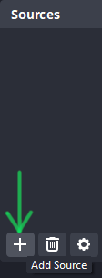
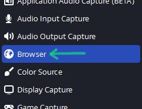
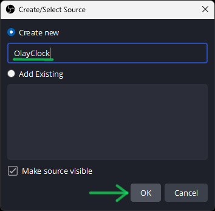
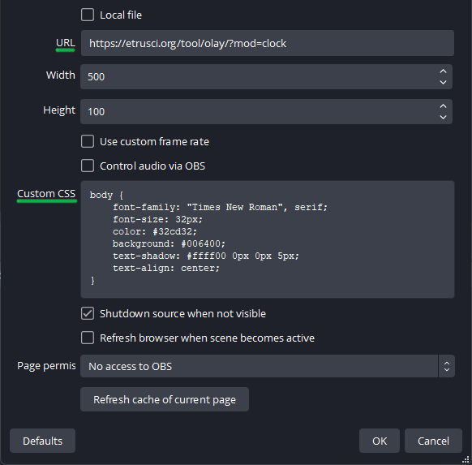
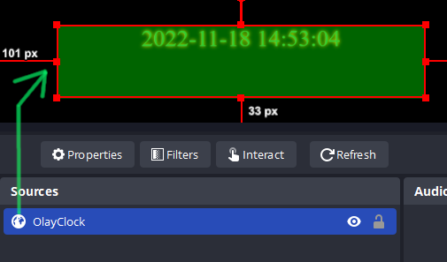

# Olay

Live stream overlay stuff for use as Browser-Source in [OBS Studio](https://github.com/obsproject/obs-studio).

---

## Modules

Demo URLs are included in the module README. For a demo go [there](https://etrusci.org/tool/olay/demo.html).

- [Clock](./app/mod/clock/README.md)
- [Kraken](./app/mod/kraken/README.md)
- [Numbers](./app/mod/numbers/README.md)
- [Quotes](./app/mod/quotes/README.md)
- [Rotator](./app/mod/rotator/README.md)
- [Uptime](./app/mod/uptime/README.md)

---

## Hosting

You are free to use the version hosted by me. The base URL is `https://etrusci.org/tool/olay/?`. See the individual module README's for URL parameters.

If you prefer to host it yourself and/or create your own modules, see [DEVELOPMENT](./DEVELOPMENT.md).

---

## Usage

**Add a Browser-Source to your Scene:**

  

**Enter the module URL, adjust CSS and other settings:**



**You did it!**



---

## Change Module Output Style

The default CSS is as follow:

```css
body {
    font-family: sans-serif;
    font-size: 16px;
    color: #00ac86;
    background: transparent;
}
div.olay {}
div.mod {}
```

`div.olay` is the outer wrapper of `div.mod`.  
`div.mod` is the inner wrapper, where the module output will displayed.

In HTML this looks like this:
```html
<div class="olay">
    <div class="mod">
        <!-- module output will here -->
    </div>
</div>
```
But you can also only change the `body` style to start. The wrappers are really just to give some more flexibility to those who want it.

Here are two examples to copy&paste into the Browser-Source's CSS field.

```css
/* Styles for the whole module page - this is most probably what you want */
body {
    font-family: "Times New Roman", serif;
    font-size: 32px;
    color: #32cd32;
    background: #006400;
    text-shadow: #ffff00 0px 0px 5px;
    text-align: center;
}
```

```css
/* Separate styles for body, div.olay and div.mod */
body {
    background: #006400;
}

div.olay {
    border: 1px solid #0000ff;
    padding: 10px;
}

div.mod {
    color: #32cd32;
    border: 1px solid #ffff00;
    padding: 10px;
}
```

New to CSS? Checkout the [CSS Docs](https://developer.mozilla.org/en-US/docs/Web/CSS)!  
Need a color picker, [click here](https://duckduckgo.com/?t=ffab&q=color+picker&ia=answer) :-)

---
