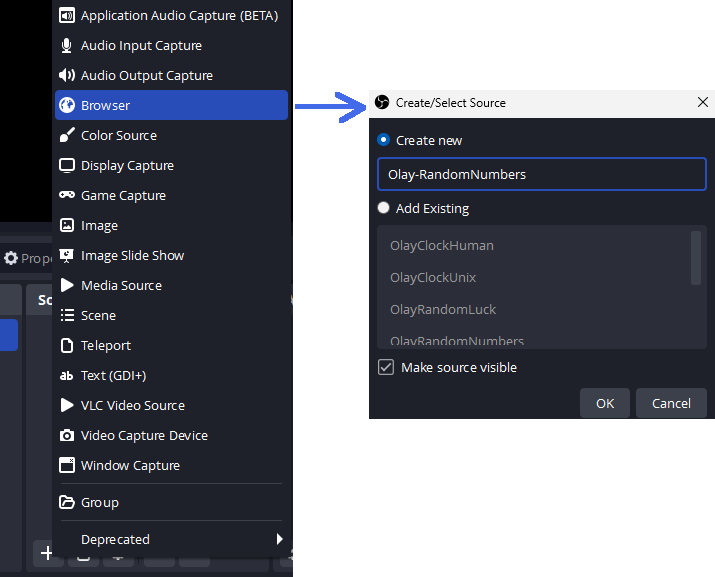
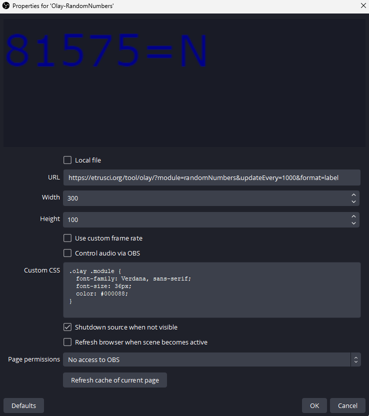

# Olay

Live stream overlay stuff for use as Browser-Source in OBS. **Work in progress**.


---

## Usage

Add a Browser-Source to your Scene:



Enter the module URL and adjust the CSS/settings to your liking:



---

## Construct Module URLs

See the module descriptions below for available parameters. We'll use the `randomNumbers` module as example here.

Start with the base URL:

```text
https://etrusci.org/tool/olay/
```

Add the module parameter:

```text
https://etrusci.org/tool/olay/?module=randomNumbers
```

Add optional parameters:

```text
https://etrusci.org/tool/olay/?module=randomNumbers&updateEvery=1000&format=label
```

---

## Module: `clock`

| Parameter     | Valid Values                       | Default |
|---------------|------------------------------------|---------|
| `updateEvery` | Milliseconds (1s = 1000ms)         | `1000`  |
| `format`      | `human`, `unix`, `milli`, `uptime` | `human` |

**Examples:**

- [?module=clock](https://etrusci.org/tool/olay/?module=clock)
- [?module=clock&updateEvery=3000](https://etrusci.org/tool/olay/?module=clock&updateEvery=3000)
- [?module=clock&format=human](https://etrusci.org/tool/olay/?module=clock&format=human)
- [?module=clock&format=unix](https://etrusci.org/tool/olay/?module=clock&format=unix)
- [?module=clock&format=milli](https://etrusci.org/tool/olay/?module=clock&format=milli)
- [?module=clock&format=milli&updateEvery=100](https://etrusci.org/tool/olay/?module=clock&format=milli&updateEvery=100)
- [?module=clock&format=uptime](https://etrusci.org/tool/olay/?module=clock&format=uptime)

---

## Module: `randomLuck`

| Parameter     | Valid Values                                                | Default |
|---------------|-------------------------------------------------------------|---------|
| `updateEvery` | Milliseconds (1s = 1000ms)                                  | `13000` |
| `luckyChance` | Floating-point numbers between 0.0 *(lose)* and 1.0 *(win)* | `0.5`   |

**Examples:**

- [?module=randomLuck](https://etrusci.org/tool/olay/?module=randomLuck)
- [?module=randomLuck&updateEvery=1000](https://etrusci.org/tool/olay/?module=randomLuck&updateEvery=1000)
- [?module=randomLuck&luckyChance=0.7](https://etrusci.org/tool/olay/?module=randomLuck&luckyChance=0.7)

---

## Module: `randomNumbers`

| Parameter     | Valid Values                       | Default  |
|---------------|------------------------------------|----------|
| `updateEvery` | Milliseconds (1s = 1000ms)         | `5000`   |
| `format`      | `simple`, `label`                  | `simple` |
| `pad`         | `true`                             | `false`  |
| `padChar`     | Any character                      | `0`      |
| `rangeStart`  | Integers                           | `1`      |
| `rangeEnd`    | Integers                           | `100000` |

**Examples:**

- [?module=randomNumbers](https://etrusci.org/tool/olay/?module=randomNumbers)
- [?module=randomNumbers&updateEvery=1000](https://etrusci.org/tool/olay/?module=randomNumbers&updateEvery=1000)
- [?module=randomNumbers&format=label](https://etrusci.org/tool/olay/?module=randomNumbers&format=label)
- [?module=randomNumbers&pad=true](https://etrusci.org/tool/olay/?module=randomNumbers&pad=true)
- [?module=randomNumbers&pad=true&padChar=X](https://etrusci.org/tool/olay/?module=randomNumbers&pad=true&padChar=X)
- [?module=randomNumbers&rangeStart=100&rangeEnd=999](https://etrusci.org/tool/olay/?module=randomNumbers&rangeStart=100&rangeEnd=999)

---

## Module: `randomQuotes`

| Parameter     | Valid Values                       | Default  |
|---------------|------------------------------------|----------|
| `updateEvery` | Milliseconds (1s = 1000ms)         | `600000` |

**Examples:**

- [?module=randomQuotes](https://etrusci.org/tool/olay/?module=randomQuotes)
- [?module=randomQuotes&updateEvery=30000](https://etrusci.org/tool/olay/?module=randomQuotes&updateEvery=30000)

---

## License

Public Domain Worldwide

---
