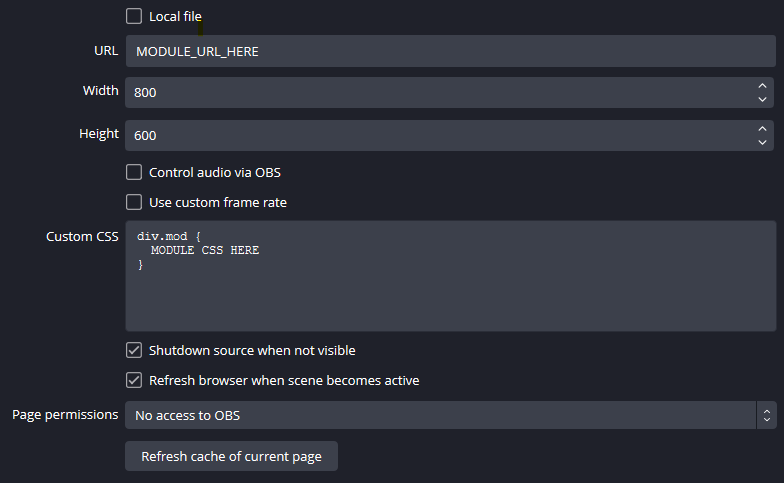

# Olay

Live stream overlay stuff for use as Browser-Source in [OBS Studio](https://github.com/obsproject/obs-studio).

---

## Modules

- [clock](./app/mod/clock/clock.md)
- [colorfader](./app/mod/colorfader/colorfader.md)
- [goal](./app/mod/goal/goal.md)
- [numbers](./app/mod/numbers/numbers.md)
- [quotes](./app/mod/quotes/quotes.md)
- [rotator](./app/mod/rotator/rotator.md)

---

## Hosting

I host the current [main branch](https://github.com/etrusci-org/olay/tree/main), which is most likely ahead of the latest release.  
Access it at: <https://etrusci.org/tool/olay/>

You can also clone this repo or download a specific [release](https://github.com/etrusci-org/olay/releases) and put it on your own webserver.

---

## Output Styling

All modules will output their content to a `<div>` with the class `mod`. Some modules may introduce sub-elements, but in general it's enough to style `div.mod` like so:

```css
div.mod {
    font-family: sans-serif;
    font-size: 42px;
    color: #009900;
}
```

Default style: [app/lib/default.css](./app/lib/default.css).

For help with CSS see:
- [CSS For Starters](./CSS.md)
- [Full CSS Reference](https://developer.mozilla.org/docs/Web/CSS)

---

## Browser-Source Settings



You must decide per use-case if you want to have both "*Shutdown source when not visible*" and "*Refresh browser when scene becomes active*" checked. For example, if you use a number counter, it'll reset when whenever the overlay becomes invisible because of a scene switch or similar actions in OBS. Also, any queue will be reset too, for example in the quotes module, and therefore you'll see more duplicates when switching scenes often.

---

## Notes

- If you're unsure, test it in a webbrowser and not OBS directly. This way you can quickly edit the URL parameters or add `&debug=true` to see the current module configuration.
- To install it on your own webserver, just copy the contents of the **olay/app/** directory.
- If you install it on your own webserver and edit the module configurations, always enter values as *strings*. E.g. enclose in single-quotes (') or backticks (`).
- It won't run if not loaded from a webserver. E.g. just loading it from your local filesystem won't work because of [CORS](https://en.wikipedia.org/wiki/Cross-origin_resource_sharing).

---
