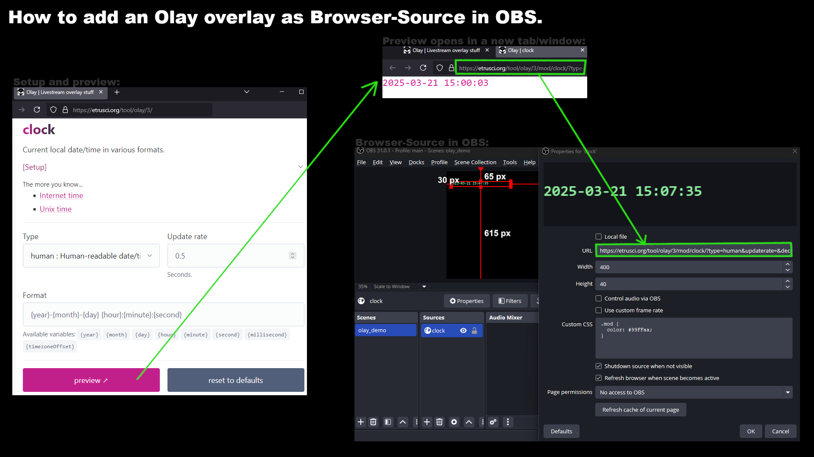

# Olay

Livestream overlay stuff for use as [Browser-Source](https://obsproject.com/kb/browser-source) in [OBS Studio](https://obsproject.com/).

## Modules

- **clock**: Current local date/time in various formats.
- **colorfader**: Fade the whole page through random colors.
- **countdu**: Count down/up within a number range or up to a future date.
- **dnmap**: A world map that shows the current day and night on Earth and the positions of the Sun (subsolar point) and the Moon (sublunar point).
- **floater**: Let a text float around the screen like the old DVD logo screensaver.
- **goal**: Status of one of your personal goals.
- **quotes**: Random quotes typewriter.
- **rotator**: Rotate through text items.
- **soho**: Current images of the sun in various spectrums.
- **twitchchat**: Chat messages from one or more Twitch channels.
- **weather**: Current weather data.

## Get started

Go to <https://etrusci.org/tool/olay/3> to read the *get started*-guide and setup/preview the overlays with the provided configurator.

Feel free to post your questions/feedback/ideas in either the [GitHub](https://github.com/etrusci-org/olay/discussions) or [OBS](https://obsproject.com/forum/threads/olay.184803) forums if you need more help with, or have specific questions about, Olay.

If you need help with CSS, please see [CSS for starters](./CSS.md).

## Self-hosting

You can also download a specific [release](https://github.com/etrusci-org/olay/releases) and put it on your own webserver.

Requirements:

- Webserver
- To build the [src/](./src/) files (see [tasks.json](./.vscode/tasks.json) for build commands):
  - tsc
  - sass
  - bash for: [watchhtml.sh](./watchhtml.sh)
  - python for: [bakehtml.py](./bakehtml.py)

To fetch dependencies, run: [fetchdep.sh](./fetchdep.sh)

Once everything is ready, copy the [olay/](./olay/) directory to your webserver.

## License

See [LICENSE.md](./LICENSE.md).
